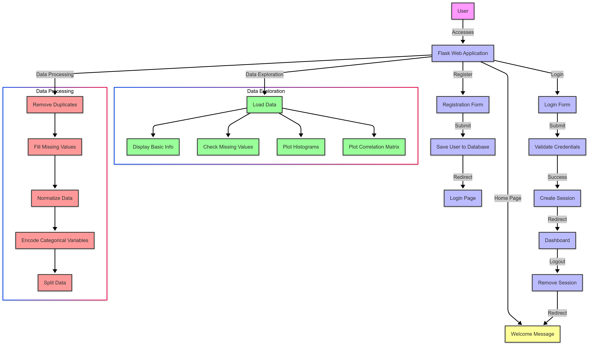

# Let's Build Web Miner AI Agent


Practical Guide : AI Enhanced Radiology Solution

## TL;DR
I built an app that uses AI to analyze medical images and generate comprehensive radiology reports. The system accepts frontal and lateral X-ray uploads along with patient information, then produces professional-grade reports following radiology standards. Using Streamlit for the frontend and Groq’s LLaMA model for AI analysis, this tool demonstrates how AI can assist in medical imaging interpretation while maintaining a modular, configurable codebase.

## Introduction:
When I first considered the challenge of making radiology more accessible, I thought about how AI could help bridge the gap between image and insight. X-rays contain vital information that only trained professionals can interpret — but what if AI could assist in this process? I created a tool that takes chest X-rays and transforms them into detailed medical reports, making the invisible visible through the power of artificial intelligence.

## What’s This Article About?
This article walks through my process of building an AI-powered radiology report generator. I’ll explain how I designed a web application that accepts chest X-ray images (both frontal and lateral views) along with patient information, then uses an AI model to analyze these images and generate comprehensive reports following professional medical standards.

The system combines a user-friendly interface with powerful backend processing to produce reports that include detailed findings across different anatomical areas, clinical impressions, and recommendations — just like a human radiologist would provide.

I’ll break down the architecture decisions, from the modular code structure to the configuration-driven approach that makes the system adaptable and maintainable.

Full Article : [https://medium.com/@learn-simplified/how-i-built-an-ai-powered-radiology-analyze-291365b12ebf


## Tech Stack  

| Component           | Technology          | Description                                          |
|---------------------|---------------------|------------------------------------------------------|
| **Frontend**        | Streamlit            | Web interface for uploading images and displaying reports |
| **AI Model**        | Groq API (LLama3-70b)| Large language model for generating radiology reports |
| **Image Processing**| Pillow               | Handling and manipulating uploaded X-ray images       |
| **API Communication**| Requests            | Making API calls to the Groq service                  |
| **Configuration**   | YAML, JSON           | Storing application settings and prompt templates     |
| **Environment**     | python-dotenv        | Managing API keys and environment variables           |
| **Styling**         | Custom CSS           | Professional UI styling for the application           |
| **Project Structure**| Modular Python      | Separate files for constants, config, API, UI components |


## Architecture




# Tutorial: How I Built an AI-Powered Radiology Analyze

## Prerequisites
- Python installed on your system.
- A basic understanding of virtual environments and command-line tools.

## Steps

1. **Virtual Environment Setup:**
   - Create a dedicated virtual environment for our project:
   
     ```bash
     python -m venv Lets-Build-Web-Miner-AI-Agent
     ```
   - Activate the environment:
   
     - Windows:
       ```bash
          Lets-Build-Web-Miner-AI-Agent\Scripts\activate        
       ```
     - Unix/macOS:
       ```bash
       source Lets-Build-Web-Miner-AI-Agent/bin/activate
       ```
   

# Installation and Setup Guide

**Install Project Dependencies:**

Follow these steps to set up and run the  "How I Built an AI-Powered Radiology Analyze"

1. Navigate to your project directory:
   ```
   cd path/to/your/project
   ```
   This ensures you're in the correct location for the subsequent steps.

2. Install the required dependencies:
   ```
   pip install -r requirements.txt   
   ```
   This command installs all the necessary Python packages listed in the requirements.txt file.


# Run - Hands-On Guide: How I Built an AI-Powered Radiology Analyze
  
   ```
   crawl4ai-download-models
   playwright install
   python main.py
   
   Data exploration UI
   
   streamlit run data_exploration.py
   
   ```
   
## Closing Thoughts

The future of AI in medical imaging extends far beyond what I’ve demonstrated here. As large language models and vision models continue to evolve, we’ll likely see AI systems that can detect subtle abnormalities with increasing accuracy, potentially identifying patterns that even experienced radiologists might miss.

The integration of AI into healthcare workflows will become seamless, with systems that not only generate reports but also prioritize cases based on urgency, track changes over time, and even predict future health outcomes based on current images. While human oversight will remain essential, AI will increasingly serve as a powerful force multiplier, enabling healthcare systems to provide faster, more accurate diagnoses to more patients.

The code structure I’ve presented — with its emphasis on modularity, configuration, and clean separation of concerns — provides a foundation that can evolve alongside these advancing technologies, allowing businesses to continuously improve their AI capabilities without rebuilding from scratch.
